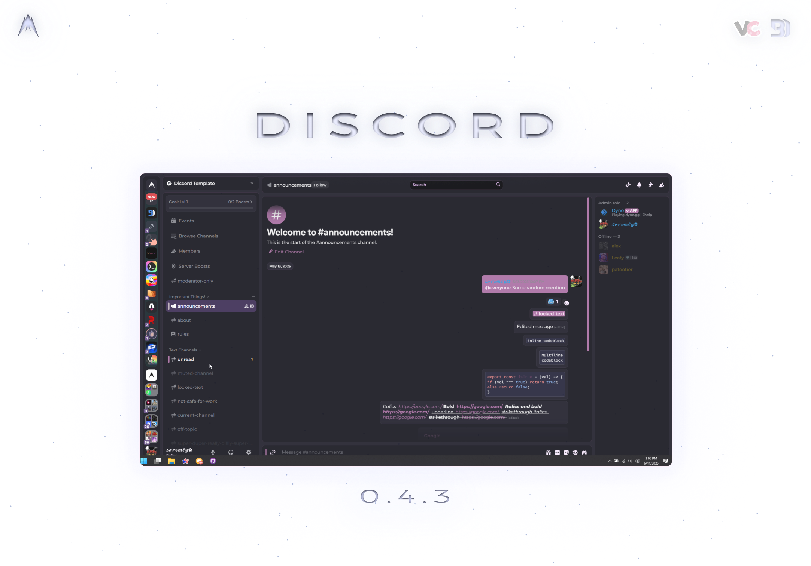

# Albatross Beta 0.4.3a


[](license)
[](https://github.com/albatrosscreative/albatross-discord/stargazers)
[](https://vencord.dev)
[](https://vencord.dev)
[](https://github.com/LeafyLuigi/sulfide)



## ⚠️ NOTICES

**1. WINDOWS ONLY**

**2. Theme Attributes is experiencing issues on BetterDiscord, use Vencord for now**

**3. Recommended for mid-high end pcs. (Use Dedicated GPU)**

**4. This theme is still under development and bugs WILL occur**

**5.Theme Attributes MUST be turned on for Albatross to function properly.**

<br>

- [Albatross Beta 0.4.3a](#albatross-beta-043a)
	- [⚠️ NOTICES](#️-notices)
	- [Changelog](#changelog)
		- [Pre-release v0.4.3a - 2024-08-23](#pre-release-v043a---2024-08-23)
			- [Added](#added)
			- [Styled Elements](#styled-elements)
			- [Bug Fixes](#bug-fixes)
	- [Known Bugs](#known-bugs)
	- [Roadmap](#roadmap)
	- [Getting Started](#getting-started)
		- [Installation](#installation)
		- [Option 1 - Download theme.css file](#option-1---download-themecss-file)
		- [Option 2 - CSS Import](#option-2---css-import)
			- [1. Base Import](#1-base-import)
			- [2. Palette](#2-palette)
		- [Option 3 - Local Installation \& Setup](#option-3---local-installation--setup)
			- [1. Clone Repository](#1-clone-repository)
			- [2. Go to project folder](#2-go-to-project-folder)
			- [3. Install dependencies](#3-install-dependencies)
			- [4. Scripts](#4-scripts)
	- [Usage](#usage)
		- [Changing palettes](#changing-palettes)
			- [Quick CSS \& via `albatross.theme.css`](#quick-css--via-albatrossthemecss)
	- [Contributors](#contributors)
	- [Credits](#credits)
	- [License](#license)

## [Changelog](/changelog.md)

All notable changes to this project will be documented in this file. Visit [changelog.md](/changelog.md) to view the full code history.

The format is based on [Keep a Changelog](https://keepachangelog.com/en/1.1.0/),
and this project adheres to [Semantic Versioning](https://semver.org/spec/v2.0.0.html).

### Pre-release [v0.4.3a](https://github.com/AlbatrossCreative/Albatross-Discord/releases/tags/0.4.3a) - 2024-08-23

[Download albatross.theme.css](https://github.com/AlbatrossCreative/Albatross-Discord/releases/tags/0.4.3)

#### Added

- Albatross Day (BETA). [Albatross Backend](https://github.com/albatrosscreative/albatross-backend) now has partial support for light mode on most palettes. Some palettes may have unfitting colors, which will be fixed in later updates. Please send feedback in our [support server]()

#### Styled Elements

- Fixed some inconsistencies throughout the theme. Still working on it
- Fixed various components across the app
- Fixed message specificity.
- Styled V2 user modals
- Styled the call section

#### Bug Fixes

- Fixed various elements in user modals and profile
- Fixed textArea element being behind pseudo element
- Fixed sidebar in direct messages and in servers
- Fixed chat right hand sidebar

**Open [Changelog](/changelog.md) to see previous release details.**

## Known Bugs

- **Bug 1:** After scrolling down a bit in your private messages, scrolling back up may cause your scroller to start jumping or send you straight back to the top.

- **Temporary solution**: For now, use your mouse cursor to drag your scrollbar upwards until you reach a point where the scroller returns to its normal function.

Reporting bugs helps Albatross grow! Spot one? Make an [Issue](https://github.com/AlbatrossCreative/Albatross-Discord/issues)

## Roadmap

Heres a list of features im planning on adding soon.

**Attention Indicators**

**🟢 Minor (Whatever)**
**🟡 Moderate (Can Wait)**
**🔴 Major (ASAP)**

| **Urgency** |                  **Feature**                   |      **Status**       |
| :---------: | :--------------------------------------------: | :-------------------: |
|     🔴      |               Light mode support               |  Actively developing  |
|     🟡      |          Nitro customization support           | Actively developing.. |
|     🟡      |           Additional plugin support            | Actively developing.. |
|     🟢      |               Add more Palettes                |        Planned        |
|     🔴      | Additional platform support (MacOS, Unix, Web) |        Planned        |

## Getting Started

### Installation

Please ensure Discord is installed with your choosing of the client mods below.

**Note: Any client mod that has a Theme Attribute capability is supported.**

<div class="tg-wrap">
	<table>
		<thead>
			<tr>
				<th>Client Mods</th>
				<th>Discord Builds</th>
			</tr>
		</thead>
		<tbody>
			<tr>
				<td align=center>
					<a href="https://betterdiscord.app/" target="_blank" rel="noopener noreferrer"
						> <span >Better Discord (Buggy)</span></a
					>
				</td>
				<td align=center>
					<a
						href="https://discord.com/api/downloads/distributions/app/installers/latest?platform=win&channel=canary&arch=x64"
						target="_blank"
						rel="noopener noreferrer"
						>Discord Canary</a
					>
				</td>
			</tr>
			<tr>
				<td align=center>
					<a href="https://vencord.dev/" target="_blank" rel="noopener noreferrer"
						><span>Vencord</span></a
					><br />
				</td>
				<td align=center>
					<a
						href="https://discord.com/api/downloads/distributions/app/installers/latest?platform=win&channel=canary&arch=x64"
						target="_blank"
						rel="noopener noreferrer"
						>Discord Stable</a
					>
				</td>
			</tr>
			<tr>
				<td colspan="2" align=center>Replugged not supported</td>
			</tr>
		</tbody>
	</table>
</div>

### Option 1 - Download theme.css file

Easiest method to install Albatross is to download `albatross.theme.css` from the [releases](https://github.com/AlbatrossCreative/Albatross-Discord/releases/latest) page. Drag and drop it into your client mods theme folder:

`BetterDiscord/themes` **OR**
`vencord/themes`

### Option 2 - CSS Import

#### 1. Base Import

- Copy and paste ALL the following links in your Quick CSS page. These are REQUIRED.

```css
@import url('https://albatrosscreative.github.io/Albatross-Discord/public/build/albatross-minified.css');
@import url('https://albatrosscreative.github.io/Albatross-Backend/theme/backend/albatross-vars.css');
```

#### 2. Palette

- Albatross also requires a palette of your choice to display properly. More palettes will be available in the future. View Palettes [here](#palettes)

```css
/* @import url('https://albatrosscreative.github.io/Albatross-Backend/theme/palettes/abyss.css'); */
/* @import url('https://albatrosscreative.github.io/Albatross-Backend/theme/palettes/comet.css'); */
/* @import url('https://albatrosscreative.github.io/Albatross-Backend/theme/palettes/crearts.css'); */
/* @import url('https://albatrosscreative.github.io/Albatross-Backend/theme/palettes/dracula.css'); */
/* @import url('https://albatrosscreative.github.io/Albatross-Backend/theme/palettes/github-dark.css'); */
/* @import url('https://albatrosscreative.github.io/Albatross-Backend/theme/palettes/github-dimmed.css'); */
/* @import url('https://albatrosscreative.github.io/Albatross-Backend/theme/palettes/heroui.css'); */
/* @import url('https://albatrosscreative.github.io/Albatross-Backend/theme/palettes/miyu.css'); */
/* @import url('https://albatrosscreative.github.io/Albatross-Backend/theme/palettes/nord.css'); */
```

### Option 3 - Local Installation & Setup

This is for advanced users looking for direct access to work and develop Albatross Discord.

#### 1. Clone Repository

Use this command to clone the repository to your desired directory.

```cmd
git clone https://github.com/AlbatrossCreative/Albatross-Discord.git
```

#### 2. Go to project folder

```cmd
cd albatross-discord
```

#### 3. Install dependencies

```cmd
pnpm install
```

#### 4. Scripts

**Use** `pnpm` **to begin using Albatross based on your use choice.**

| Script    | Description                                                 |
| :-------- | :---------------------------------------------------------- |
| `buildVC` | compiles `_source.scss` to `vencord/themes/albatross.theme.css`       |
| `buildBD` | Creates `_source.scss` to `betterdiscord/themes/albatross.theme.css` |
| `compile` | Compiles `_source.scss` to `public/build/css`             |
| `devBD`   | Begin live development for BetterDiscord.                   |
| `devVC`   | Begin live development for Vencord.                         |

## Usage

### Changing palettes

Heres how to swap out your palettes based on which method you've installed Albatross.

#### Quick CSS & via `albatross.theme.css`

1. Open QuickCSS albatross.theme.css in your themes folder. (If you use BetterDiscord you can edit the file within the themes page)
2. Comment out the palettes you don't want.

```css
/* @import url('https://albatrosscreative.github.io/Albatross-Backend/theme/palettes/abyss.css'); */
/* @import url('https://albatrosscreative.github.io/Albatross-Backend/theme/palettes/comet.css'); */
/* @import url('https://albatrosscreative.github.io/Albatross-Backend/theme/palettes/crearts.css'); */
/* @import url('https://albatrosscreative.github.io/Albatross-Backend/theme/palettes/dracula.css'); */
/* @import url('https://albatrosscreative.github.io/Albatross-Backend/theme/palettes/github-dark.css'); */
/* @import url('https://albatrosscreative.github.io/Albatross-Backend/theme/palettes/github-dimmed.css'); */
/* @import url('https://albatrosscreative.github.io/Albatross-Backend/theme/palettes/heroui.css'); */
/* @import url('https://albatrosscreative.github.io/Albatross-Backend/theme/palettes/miyu.css'); */
/* @import url('https://albatrosscreative.github.io/Albatross-Backend/theme/palettes/nord.css'); */
```

3. Uncomment the palette you'd like. (Only 1 at a time)

```css
/* @import url('https://albatrosscreative.github.io/Albatross-Backend/theme/palettes/crearts.css'); */
/* @import url('https://albatrosscreative.github.io/Albatross-Backend/theme/palettes/comet.css'); */
@import url('https://albatrosscreative.github.io/Albatross-Backend/theme/palettes/nextui.css');
/* @import url('https://albatrosscreative.github.io/Albatross-Backend/theme/palettes/dracula.css'); */
/* @import url('https://albatrosscreative.github.io/Albatross-Backend/theme/palettes/miyu.css'); */
/* @import url('https://albatrosscreative.github.io/Albatross-Backend/theme/palettes/nord.css'); */

/* rest of code ... */
```

## Contributors

If your wishing to contribute, it's important to note that this theme is developed using [Sulfide](https://github.com/LeafyLuigi/sulfide), Which is used throughout the theme and must be understood before attempting to begin developing. Please read Sulfides [README](https://github.com/LeafyLuigi/sulfide/?tab=readme-ov-file#usage) for information on how to use sulfide.

Please make an issue/pull request, or contact me in our [Discord Server](). Visit [contribution.md](/contribution.md) for more information on how to contribute to Albatross.

## Credits

Albatross is inspired by and uses designs from the following projects. Albatross would'nt be what is it without them

- **[CreArts](https://github.com/CreArts-Community/CreArts-Discord) by [CreArts-Community](https://github.com/CreArts-Community)**
- **[RadialStatus](https://github.com/DiscordStyles/RadialStatus) by [DiscordStyles](https://github.com/DiscordStyles)**
- **[SettingsModal](https://github.com/mwittrien/BetterDiscordAddons) by [DevilBro](https://github.com/mwittrien)**

## License

This project is under the **[GNU General Public License v3.0](https://spdx.org/licenses/GPL-3.0-or-later.html)**. Please refer to the [License](license) for further information regarding the license' permissions, limitations and conditions.

<br>
<br>
<div align="center">

Made with ♥️ by [Albatross Creative](https://github.com/albatrosscreative)

<small>Developed with <a href="https://github.com/LeafyLuigi/sulfide">Sulfide</a> by <a href="https://github.com/leafyluigi">LeafyLuigi</a></small>

</div>
